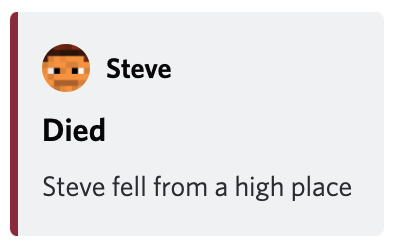

# Discord

## Configuration

Update `webhookUrl`
with [your channel's webhook url](https://discord.com/developers/docs/resources/webhook#execute-webhook).

```yaml
discord:
  # See https://discord.com/developers/docs/resources/webhook#execute-webhook
  # i.e. https://discord.com/api/webhooks/{webhook.id}/{webhook.token}
  webhookUrl: replace-me
```

Set the username for your bot. This is **NOT** a real Discord user, just the name you want to the messages to '_come
from_'. Optionally you can set an avatar url for the left column avatar.

```yaml
# Default name to use for the messages, does not need to be a real user.
botUserName: ELFIM
botAvatarUrl: replace-me
```

If you have a [Gravatar](https://en.gravatar.com/), you can set your `gravatarEmail` and that will
override `botAvatarUrl` with the Gravatar link.

```yaml
# If gravatarEmail is set, gravatarUrl (+ hash of email) will override the value set for discord.botAvatarUrl
gravatarEmail: replace-me
```

## Colors

Discord allows 'Embeds' which can be configured with colors. The weird thing is you must use a decimal number for the
color instead of the more common hex value.

```yaml
# Colors must be integers, use https://www.spycolor.com/ to get the decimal index of a color.
# These default colors are awful, you should change them.
colors:
  playerAdvancement: 9287168
  playerChat: 8890731
  playerCommand: 32768
  playerDeath: 10233154
  playerFailedLogin: 16712510
  playerJoin: 2061822
  playerLeave: 2061822
  serverBroadcast: 9055202
  serverCommand: 16733603
  serverPlugins: 15785090
  serverShutdown: 16744192
  serverStartup: 16744192
```

## Examples

### Server Events

#### Server Started event


#### Server Stopping event


#### Server Command event


### Player Events

#### Player Joined event


#### Player Left event


#### Player Died event



#### Player Chat event


#### Player Advancement event


#### Player Command event


