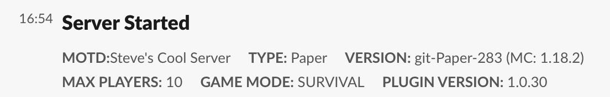
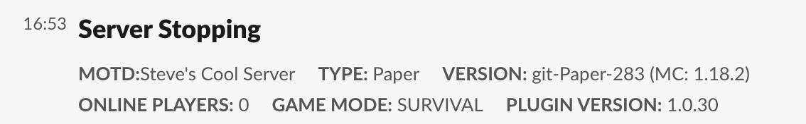
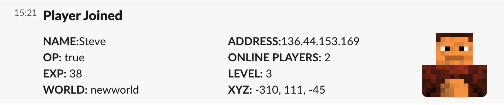
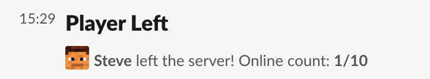
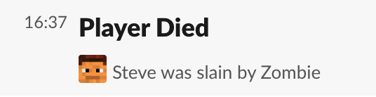
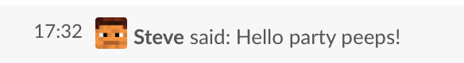
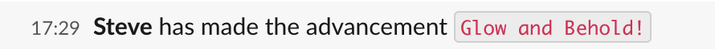
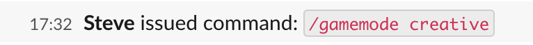

# Slack

## Configuration

Update the following with [your api token](https://api.slack.com/tutorials/tracks/getting-a-token) and the ID of the
channel where the messages should be sent. (_this is found at the bottom of the 'View Channel Details' option_)
That is, replace each `replace-me` with their respective values.

```yaml
slack:
  # See https://api.slack.com/tutorials/tracks/getting-a-token
  apiToken: replace-me
  channelId: replace-me
```

Once those values are populated restart the server to enable full functionality. Each event can be toggled on or off via
a console command or by editing `config.yml`.

```yaml
slack:
  events:
    logBroadcasts: true|false
    logChat: true|false
    logPlayerAdvancement: true|false
    logPlayerCommands: true|false
    logPlayerDeath: true|false
    logPlayerJoinLeave: true|false
    logServerCommand: true|false
    logServerStartStop: true|false
    logStartupPlugins: true|false
    logUnsuccessfulLogin: true|false
```

## _elfs_ Command

_elfs_ (event logger for slack)

- `/elfs [enable|disable <key>] [set token|channel|avatarUrl|bustUrl <value>]` (_note: settings take effect after server
  restart_)

### Permissions

In order to use the `elfs` command you must have the `ELFIM.elfimadmin` permission explicitly set on your user. The
easiest way to do that is with another plugin like [LuckPerms](https://luckperms.net/).

### Example commands

- `elfs enable slack` or `elfs disable slack`
- `elfs set channel ABC123`
- `elfs disable logBroadcasts`

## Examples

### Server Events

#### Server Started event



#### Server Stopping event



### Player Events

#### Player Joined event



#### Player Left event



#### Player Died event



#### Player Chat event



#### Player Advancement event



#### Player Command event


